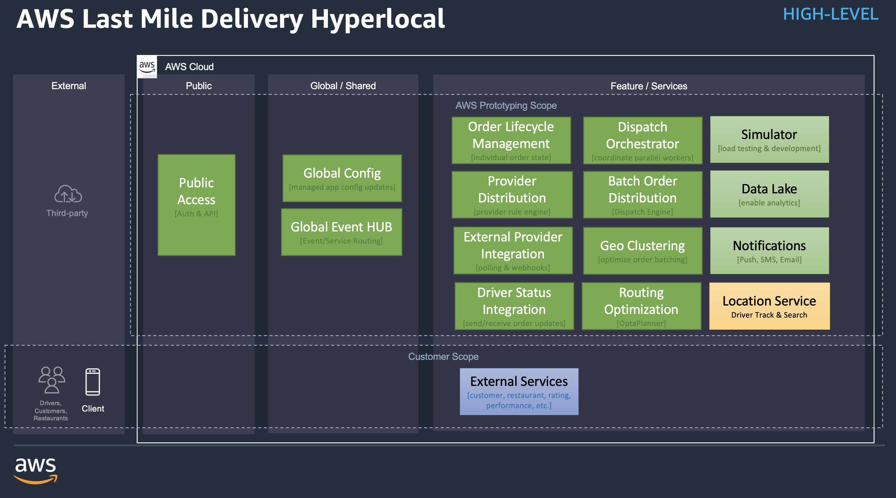
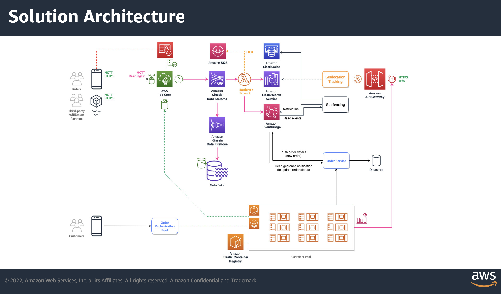

# AWS Last Mile Delivery Hyperlocal - Last Mile Logistics Accelerator

| :warning: Disclaimer :warning: |
|------------|
| This codebase is currently work in progress and requires improvements in a few areas before using it. The remaining issues are being tracked in [this project](https://github.com/aws-samples/aws-last-mile-delivery-hyperlocal/projects/1) and actively being developed. <br /> This disclaimer will be removed once all non-`priority:low` issues are being resolved. |

## :star: Introduction

Hyperlocal businesses that involve Grocery, Food Delivery, Instant Courier, etc, are likely to reach _3.4 Trillion USD_ by 2027. Hundreds of such businesses are being launched all across the world. This accelerator project will help these companies to avoid the undifferentiated heavy lifting by providing them a re-usable solution for tracking their (tens of thousands of) drivers and instantly make pick-up and routing decisions. The system provides granular real time tracking, complex search, as well as assignment of drivers to orders using optimisation techniques.

## Getting started

* [Quick start guide](./docs/quick-start.md) - deploy the solution in your AWS account
* [Detailed documentation](./docs/README.md) - details about this project
* [Development Guide](docs/development/README.md) - get started implementing your custom features

## Architecture

### High-level Architecture



### Solution Architecture



### Folder Structure

```txt
.
├── _templates (generators for packages and components)
├── config (workspace configuration files)
├── docs (detailed documentation)
├── packages (common packages used in prototype infra and apps)
└── prototype (main infra, app code and scripts)
    ├── dispatch
    ├── infra
    ├── scripts
    └── simulator
```

## Requirements - Tooling

* [AWS CLI version 2](https://docs.aws.amazon.com/cli/latest/userguide/install-cliv2.html)
* [VSCode](https://code.visualstudio.com) highly recommended
  * [VS Code ESLint extention](https://marketplace.visualstudio.com/items?itemName=dbaeumer.vscode-eslint) - Required if using vscode and want auto integration with eslint
* [nodejs](https://nodejs.org) with [yarn](https://yarnpkg.com)
* Java -- [Corretto 11 preferred](https://aws.amazon.com/corretto)
* [Docker](https://www.docker.com)

---

## Security

See [CONTRIBUTING](CONTRIBUTING.md#security-issue-notifications) for more information.

## License

This library is licensed under the MIT-0 License. See the LICENSE file.
