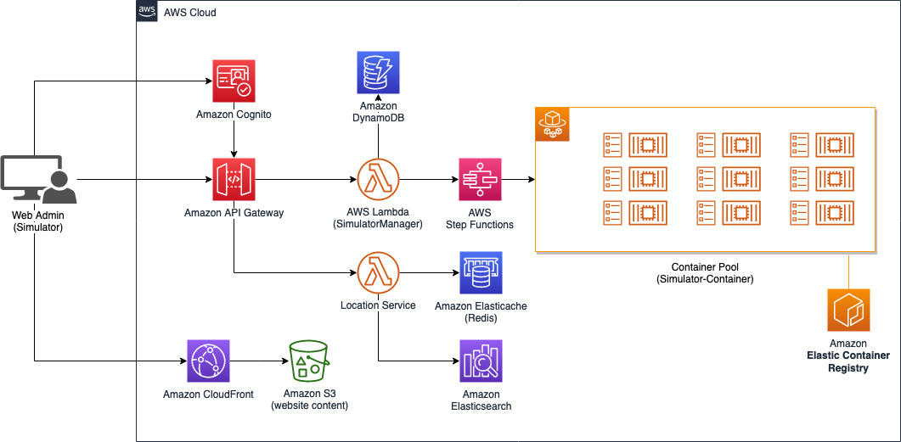
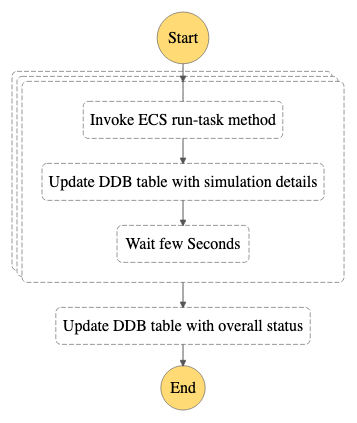

# Simulator

During the development of the prototype there was a need to test the solution at scale and verify interactively whether the events were consumed as expected. As such, a Simulator was developed to facilitate integration work and debugging while using a simple web interface to start new simulation and interact with APIs provided during the engagement.

## Architecture 

The simulator is composed by 3 main components:

-	Web UI
-	Simulator Container
-	Mock Services

The Simulator exposes APIs through Amazon API Gateway which allows the end user to start a new simulation, monitor the current execution or invoke the Location Service API to retrieve drivers from the Web UI.

## Web UI

The Web UI gives a simple way for admin to start new simulation, monitor the position of the simulated drivers in an interactive map and interact with mock services to simulated an end-to-end flow (eg. create an order to simulate geofencing). It also provides interface to query the Location Service APIs (get drivers and query by polygon) and helps to understand interaction between service by visualizing the event history. 

The Web UI is built in Reactjs and utilize [AWS NorthStar](https://github.com/aws/aws-northstar) library to provide a look-and-feel similar to the AWS Console. The UI is exposed through a CloudFront distribution backed by an Amazon S3 bucket that contain the build assets of the React project.

The Web UI also uses [MapBox](https://www.mapbox.com/) for the visualization, a token is required in order to use it for the map functionality.

## Simulator Container

This component is the one that provides the simulated location update events. It’s an application packaged in Docker and pushed in an Elastic Container Registry (ECR) to allow the Elastic Container Service (ECS) to run it. 

From the Web UI the end user can define the number of drivers to provision and the area where the driver should be located and these parameters will define the number of containers to start in ECS. Each container can run multiple drivers (according to the memory utilized by the task). During the Load Test, 5 drivers per container were simulated, but there’s enough memory to run up to 6 drivers per container. The task definition can be updated to allow the container to run more drivers, by increasing the memory and/or CPU, if needed.

During the startup the simulator will create an Amazon Cognito user to simulate the driver and will tear it down when the stop signal is sent from the UI. The Simulator also fetches the latest version of the configuration which defines the frequency and the interval to be used to capture GPS location and send them to the cloud.

The drivers are provisioned in 3 main predefined areas and they will use pre-defined paths to simulate movements in when is in an IDLE state. Whenever the driver receives a command from the cloud to pickup an order (eg. order dispatching message), it will automatically accept the order and follow the routing details in the message to simulate a delivery.

To startup the ECS Tasks the Simulator replies on an **AWS Step Function** workflow take into consideration the API rate limiting and allow to spinup thousands of containers in an asynchronous process.

## Mock Services

Given the limited scope of the prototype, to simulate and end-to-end flow additional services were created/mocked to provide missing functionalities. This allows a driver that share the location to pickup orders and move towards a path defined by the routing details and simulate movements in the map. Mock services include: Order, Dispatch Engine and Routing/ETA.

For routing details the prototype uses [Google Maps directions API](https://developers.google.com/maps/documentation/directions/quickstart) and send the coordinates using the [polyline algorithm](https://developers.google.com/maps/documentation/utilities/polylinealgorithm) to the client which guarantee lower payload size (and thus reduce outbound traffic).

The Simulator Container utilise [MapBox polyline library](https://github.com/mapbox/polyline) to parse the information contained in the string and thus use the points inside for routing details.