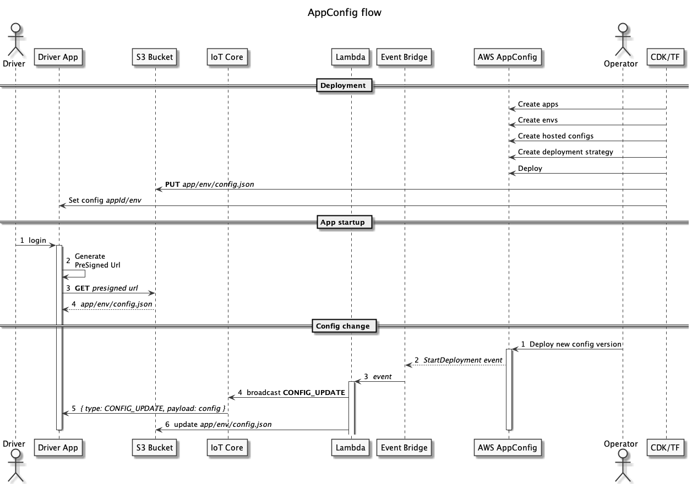

# Application Config

To support configurable driver, restaurant and customer applications, as well as preparing the system for future A/B testing, we use AWS AppConfig service to host and manage configurations.

## AppConfig flow

## Deployment

We create the following resources at deployment time [current implementation]:

* Driver and Customer _Application_
* Driver Application's Dev and Prod _Environment_
* _Hosted configuration profile_ for the Driver application along with its first _version_
* _Deployment strategy_ for immediate deployment
* S3 bucket to host latest versions of configurations in JSON format

## Retrieving appclication configuration

Each mobile application should retrieve the latest version of the configuration for its own application ID and environment from the S3 bucket. These parameters are available at startup time and the app is generating a presigned URL, fetches it and loads it for its operation. We provide example code for this process in the simulator.

## Updating online devices

In case of changing the configuration, we provide a solution to automatically _push_ the changes to online devices. Once the AppConfig deployment is triggered, a lambda function is catching the event and updates the relevant config file in the S3 bucket and sends a broadcast message to all online clients with the new configuration values.

**Note:** For future A/B testing, we recommend to setup broadcast channels for the testing environment(s), so only devices that are listening to those channels will receive the updated configurations.