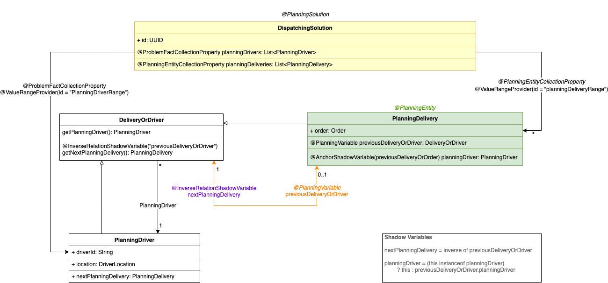
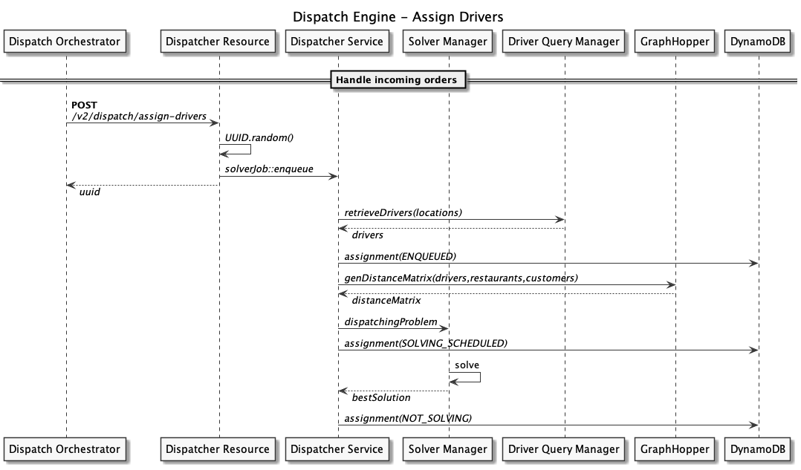

# Order Dispatcher

The Order Dispatcher is a custom implementation of the Order Dispatching problem using [Optaplanner](https://optaplanner.org).

For technical deep-dive, we highly recommend to immerse yourself in the [Optaplanner documentation](https://docs.optaplanner.org/latest/optaplanner-docs/html_single/) thoroughly,
to get familiarized with the concepts Optaplanner introduces and uses. This documentation uses expressions, definitions and concepts from the Optaplanner documentation.

The following list contains the "must-have" definitions/sections from the documentation to overview:
* Planning problem, Domain modeling
* Constraints, Score, Score type, Constraint Streams
* Solutions, Solver, SolverManager
* Problem fact
* Planning Entity
* Planning Variable, Anchor/Shadow variable

## Order Dispatching problem model

The Order Dispatching model is represented on the following diagram:



The model design follows Optaplanner's documentation on [model design](https://docs.optaplanner.org/latest/optaplanner-docs/html_single/#domainModelingGuide).

### Chained Planning Variables

In our model, we use the Chained Planning Variable concept ([Optaplanner docs 4.3.5.4](https://docs.optaplanner.org/latest/optaplanner-docs/html_single/#chainedPlanningVariable)).
We define the Drivers as _Anchor_ and the deliveries assigned to that driver will form a chain. Each Delivery in the chain will point to a previous delivery, while the first delivery
that's assigned to the driver points directly to the driver.

```
[Anchor] = [Driver #1] <-- Delivery_11 <-- Delivery_12 <-- ... <-- Delivery_1N
...
[Anchor] = [Driver #i] <-- Delivery_i1 <-- Delivery_i2 <-- ... <-- Delivery_iN
```

Additionally, each _delivery_ maintains a pointer to the driver it is assigned to, through which it can acquire the driver and its whole chain if necessary.
Through the _previousDelivery_ pointer, the information of the previous delivery's drop-off (customer) location can be acquired.

### PlanningDriver

_PlanningDriver_ represents the driver in the planning process. It holds information about the driver that's active in the system (id, driverIdentity, status), the driver's actual
location, and also a pointer (inverse relationship shadow variable) to the first delivery that is assigned to the driver.

### PlanningDelivery

_PlanningDelivery_ represents the delivery in the planning process. It holds information about the order, including the restaurant and customer location, as well as pointers that are
maintained for the previous/next deliveries - assigned to the same driver - in the chain. In our model, PlanningDelivery is the _PlanningEntity_.

### DeliveryOrDriver

_DeliveryOrDriver_ is an interface, a helper that is implemented both by _PlanningDriver_ and _PlanningDelivery_ classes. In the chained planning variables modeling, each node in the chain must
be a class implementing this interface, maintaining the pointes to the proper objects.

### DispatchingSolution

_DispatchingSolution_ represents the _PlanningSolution_ provided by Optaplanner. Following best practices provided by Optaplanner documentation, we define a list of
PlanningDrivers as *ProblemFactCollection* and the list of PlanningDelivery as *PlanningEntityCollection*.

### Constraint definitions

To provide rules for Optaplanner, we define constraints through a _ConstraintProvider_ implementation. In our order dispatching model, we defined 3 constraints. To understand how
scoring and constraints work, refer to [Optaplanner documentation - Score calculation](https://docs.optaplanner.org/latest/optaplanner-docs/html_single/#scoreCalculation).

The constraints implemented in the prototype are the following:

1. Distribute the orders amongst drivers as much as possible: if there are free drivers, assign orders to them instead of assigning multiple orders to one driver.
2. Prefer closer drivers to a pickup point (restaurant) than one that is further.

**Note**: The constraints that have been defined and implemented are conforming the prototype's simulator requirements (one order per driver). For production, please see the recommendations section where we explain what concepts should be taken into account.

## Order Dispatcher API

The Order Dispatcher module exposes the following REST endpoints (see `api/v2/DispatcherResource.java`):

* `POST` `/v2/dispatch/assign-drivers` - trigger a driver-order assignment process
* `GET` `/v2/dispatch/status/{problemId}` - retrieve the status of a previously submitted problem

Due to heavy resource usage (see Distance Matrix calculation section), we are using **JobRunr**, a Distributed Java Background Job Scheduler. This enables the system to immediately respond to every request without causing unnecessary waiting times, resulting in increased lambda usage cost, optional timeouts that could cascade to reaching lambda concurrency limits while the system is under heavy load.

When an assingment request is triggered by the _Order Orchestrator_, the dispatch engine receives the necessary data and descriptors to kickstart an instance of the problem in the solver. The request contains a list of orders that have been already geoclustered, along with the `executionId` of the order orchestrator instance.

This way, we can limit the number of orders, forcing the system to operate _locally_, meaning the problem space can be kept relatively small, thus, the actual solver execution time will be low, so the system can assign drivers fast.

The following sequence diagram shows how the dispatch engine is handling an incoming assignment request and what actions are taken in what order.



## Distance Matrix

When running the Solver, we need to take into account the distance between two locations. By the time the solver is running, we must have a pre-calculated, in-memory data that represents distances between any two locations our system knows about and we must be able to retrieve the distances in `O(1)` time. To address this problem, we build a distance matrix every time we receive an assignment request.

We use `GraphHopper`'s JAVA SDK along with `OpenStreetMap` to calculate distances between each pairs of:
* driver - restaurant
* restaurant - customer

This way we can make sure we have the distance results at hand when the solver is using distance as a measure to assign a driver to a certain order.

The process of creating a distance matrix is resource heavy (and quadratic depending on the number of input locations), so optimizations could be introduced. Check out the _recommendation_ section of this doc on the topic of routing.
## Containerization and deployment

We provide a `Dockerfile` and a `build_docker.sh` _build script_ to create a docker image that can be ran as a standalone container.
Pre-requisites for building the docker image include pre-downloaded openstreetmap files and pre-built graphhopper cache.

Once the image is built, the script automatically pushes it to an Amazon ECR repository.

In the cloud, we create an **ECS service** that is backed with EC2 instances (Graviton, C6G instances for compute-heavy load) in an autoscaling group. For preparing the docker image and the ECR repo, please check out the `Quick Start Guide`.

## Configuration

Most of the application-related configuration settings are set in the `application.properties` (and `application-docker.properties` for building the docker image).
The solver-related configuration settings are setup in the `dispatchSolverConfig-vX.xml` files. For further explanation on the settings please refer to the Optaplanner documentation.

The prototype implements retrieving geographical area-related configuration, but it doesn't apply it to the constraints, due to the nature of how the simulator has been implemented. When activating this feature, you can pass the reference to the configurations to each planning entity/variable and use a weighting function that takes the various configuration settings into consideration.
